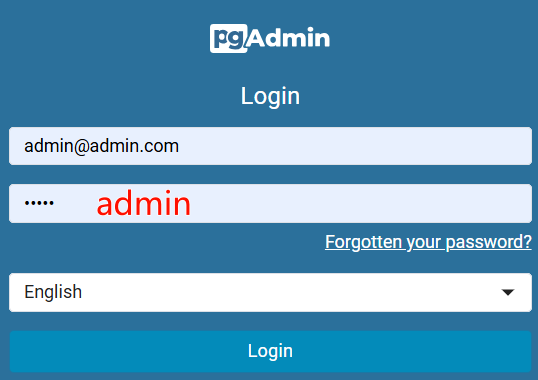
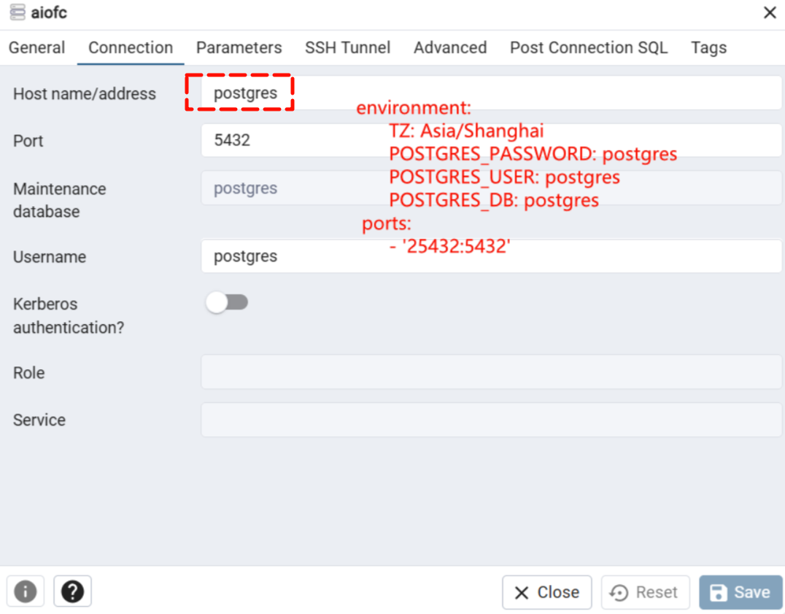

# docker
### 数据库镜像
```yaml
services:
  postgres:
    image: postgres:16.3
    environment:
      TZ: Asia/Shanghai
      POSTGRES_PASSWORD: postgres
      POSTGRES_USER: postgres
      POSTGRES_DB: postgres
    ports:
      - '25432:5432'
    volumes:
      - platform-postgres_data:/usr/share/docker/postgresql
      - ./deploy/postgres:/docker-entrypoint-initdb.d
  pgadmin:
    image: dpage/pgadmin4
    environment:
      - PGADMIN_DEFAULT_EMAIL=admin@admin.com
      - PGADMIN_DEFAULT_PASSWORD=admin
    ports:
      - 25050:80
    depends_on:
      - postgres
  pgbouncer:
    image: bitnami/pgbouncer:1.23.1
    container_name: pgbouncer
    hostname: pgbouncer
    restart: always
    environment:
      - PGBOUNCER_DATABASE=*
      - POSTGRESQL_USERNAME=postgres
      - POSTGRESQL_PASSWORD=postgres
      - POSTGRESQL_DATABASE=platform
      - POSTGRESQL_HOST=postgres
      - POSTGRESQL_PORT=5432
    ports:
      - 6432:6432

  redis:
    container_name: redis
    hostname: redis
    image: redis

  redis-commander:
    container_name: redis-commander
    hostname: redis-commander
    image: ghcr.io/joeferner/redis-commander:latest
    restart: always
    environment:
    - REDIS_HOSTS=local:redis:6379
    ports:
    - "8081:8081"
    user: redis

volumes:
  platform-postgres_data:
  platform-redis_data:
```
## 说明

### pgadmin

::: info
根据镜像的环境变量填入参数
:::


